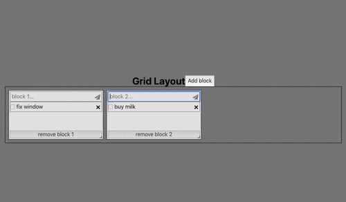

demo app using react-grid-layout

[live DEMO](https://anisg.github.io/demo-react-grid-layout/)



## run the app

```
$> yarn install
$> yarn start
```

if you want to edit the graphql operations in [`src/pages/Root.tsx`](/src/pages/Root.tsx):

```
$> yarn global add apollo
$> apollo plugins:link ./scripts/generate-local-graphql
$> apollo generate-local-graphql
```

generate-local-graphql is a homemade plugin which generates graphql types and operations for typescript.

